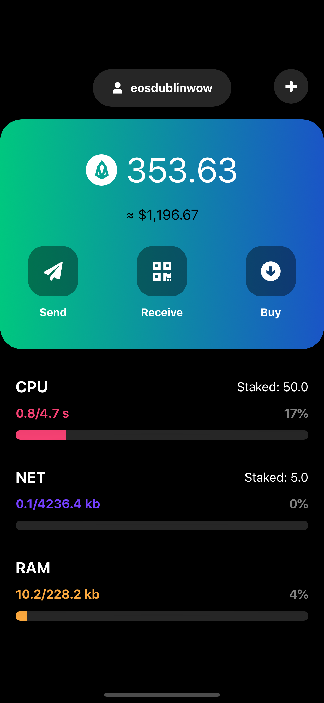

<h1 align="center">
  EOSAccount
   
</h1>

<h4 align="center">The iOS app with basic information of EOS wallet</h4>

    
  	
    
    <a href="https://github.com/popcornomnom/EOSAccount/blob/master/LICENSE">
      
    

---

An EOS wallet application for iOS using `Repository` & `MVVM` patterns. 

### What does it show:
- [x] the token balance in EOS and USD currencies
- [x] the RAM, CPU and NET consumption
- [x] the staked CPU and NET resources

### What's there:
- [x] no third party libraries
- [x] basic Unit Tests

### What's not there:
- [ ] login/logout
- [ ] send, buy functionallity

# Footnotes
Thanks [Milosky](https://miloskiy.com) for amaizing design.

EOSIO Documentation: [EOSIO API Reference](https://developers.eos.io/eosio-nodeos/reference).

Contributions are welcome! ☺️

# Contacts

 🍿
      &nbsp;&middot;&nbsp;
    <a href="http://popcornomnom.com"> <b>Blog</b> </a>
      &nbsp;&middot;&nbsp;
    <a href="https://www.linkedin.com/in/popcornomnom/">LinkedIn</a>
      &nbsp;&middot;&nbsp;
    <a href="https://www.facebook.com/popcornomnom">Facebook</a>
      &nbsp;&middot;&nbsp;
 🍿

